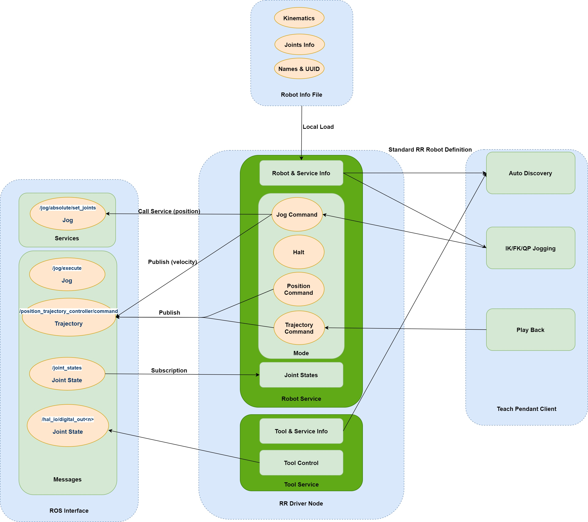

# Tormach ZA06 Robot Raconteur Driver (Through ROS API)
Robot Raconteur is an object oriented robot communication library. This driver utilize [standard RR robot definition.](https://github.com/robotraconteur/robotraconteur_standard_robdef/blob/master/group1/com.robotraconteur.robotics.robot.robdef)

## Prerequisite (Driver):
* Ubuntu
* Python
* [Robot Raconteur](https://github.com/robotraconteur/robotraconteur/wiki/Download) 
* [ROS 1](http://wiki.ros.org/noetic/Installation) 

## Prerequisite (Client):
* [Robot Raconteur](https://github.com/robotraconteur/robotraconteur/wiki/Download) (Follow instruction to download, depending on different OS or programming environment)

## Instructions:


### Running RR driver on Tormach Computer
* Start Pathpilot and Docker running on Tormach control computer

Double click `PathPilot` application, load selected version, then
```
docker exec -it ros-None-ui bash
source /opt/ros/noetic/setup.bash
```
Inside docker terminal, run
```
cd Desktop/Tormach_RR_Driver/
python tormach_driver2.py
```
Everytime a new docker terminal is started, dependencies will be installed (~1min).


### Running RR client
* Jog joint position & Position command example
```
python tormach_client1.py
```
* Jog joint velocity & Trajectory command example
```
* python tormach_client2.py
```





